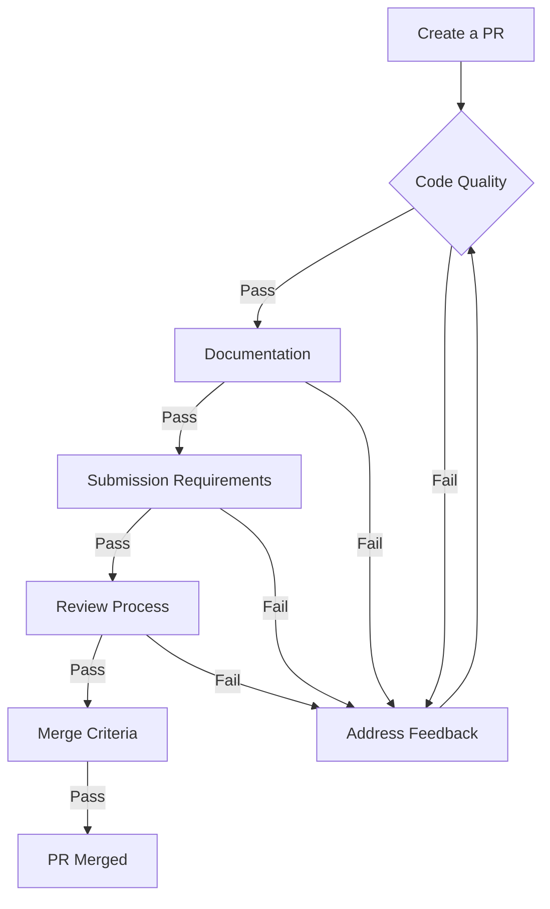

# Contributing to GreenWave

Thank you for your interest in contributing to GreenWave!

We appreciate your help in making GreenWave better. Please follow the guidelines in this document to ensure a smooth contribution process.

## Table of Contents

- [Getting Started](#getting-started)
- [Development Workflow](#development-workflow)
- [Coding Standards](#coding-standards)
- [NGSI-LD Integration Standards](#ngsi-ld-integration-standards)
- [Design Patterns](#design-patterns)
- [Testing Guidelines](#testing-guidelines)
  - [Core Testing Principles](#core-testing-principles)
  - [Test Organization](#test-organization)
  - [Test Quality](#test-quality)
  - [Tools and Resources](#tools-and-resources)
- [Pull Request Process](#pull-request-process)
- [Need Help?](#need-help)

## Getting Started

### Fork the Repository

Start by forking the main GreenWave repository.

### Clone Your Fork

```bash
git clone https://github.com/YOUR-USERNAME/GreenWave.git
```

### Add Upstream Remote

```bash
git remote add upstream https://github.com/ORIGINAL-OWNER/greenwave.git
```

### Auto Line Ending Configuration

Ensure your Git configuration is set to handle line endings correctly (especially if working between Windows and Linux for Docker):

```bash
git config --global core.autocrlf input
```

## Development Workflow

1. **Create a Branch**

   ```bash
   git checkout -b feature/your-feature-name
   ```

2. **Make Changes**: Follow the coding conventions described below

3. **Commit Changes**: Use descriptive commit messages (Conventional Commits)

4. **Push to Your Fork**

   ```bash
   git push origin feature/your-feature-name
   ```

5. **Create a Pull Request**: Submit your changes for review

For the branching strategy, please refer to the Git Flow model.

## Coding Standards

- Follow PEP 8 style guide for Python code
- Use strict type hinting (typing module) for all function arguments and return types
- Implement unit tests for all business logic and RL agents
- Maintain service boundaries - IoT Agents should not directly access the database
- Follow .editorconfig (or pyproject.toml) settings for code formatting (Black/Ruff)
- Prefer explicit variable names over mathematical abbreviations (e.g., `traffic_density` instead of `td`)
- Use Python dataclasses or Pydantic models for data structures
- Use docstrings (Google style) for all classes and methods

### Example

```python
from dataclasses import dataclass
from typing import List, Optional

class TrafficDomainException(Exception):
    """Custom exception for traffic domain errors."""
    pass

@dataclass
class Intersection:
    id: str
    connected_roads: List[str]

    def __post_init__(self):
        if not self.id:
            raise TrafficDomainException("Intersection ID cannot be empty.")

class TrafficService:
    def get_intersection(self, intersection_id: str) -> Intersection:
        """
        Retrieves intersection details by ID.

        Args:
            intersection_id: The unique identifier of the intersection.

        Returns:
            An Intersection object.
        """
        if not intersection_id:
            raise ValueError("ID is required")
        # Logic to fetch data...
        return Intersection(id=intersection_id, connected_roads=[])
```

## NGSI-LD Integration Standards

When working with NGSI-LD entities for Context Broker communication:

- Always use the Smart Data Models standard URIs
- Follow the naming convention `urn:ngsi-ld:[Entity]:[ID]` (e.g., `urn:ngsi-ld:AirQualityObserved:001`)
- Include `observedAt` timestamp for all sensor data to ensure time-series accuracy
- Implement proper `unitCode` (UN/CEFACT standard) for measurements

> [!CAUTION]
> Do not modify the structure of standard Data Models (like AirQualityObserved) without updating the @context. The Orion-LD broker relies on valid JSON-LD contexts for proper data expansion and compaction.

### Example NGSI-LD Entity

```json
{
  "id": "urn:ngsi-ld:AirQualityObserved:San-Martino",
  "type": "AirQualityObserved",
  "dateObserved": {
    "type": "Property",
    "value": "2025-11-23T12:00:00Z"
  },
  "NO2": {
    "type": "Property",
    "value": 22,
    "unitCode": "GP"
  },
  "refDevice": {
    "type": "Relationship",
    "object": "urn:ngsi-ld:Device:San-Martino-Sensor"
  }
}
```

## Design Patterns

- **IoT Agent Pattern**: Decouple simulation (SUMO) from the Context Broker
- **Context Broker as Single Source of Truth**: All state changes must go through Orion-LD
- **Reinforcement Learning Loop**: State -> Agent -> Action -> Reward -> State
- Avoid circular dependencies between Docker services
- Keep AI Agents stateless; fetch state from Broker
- Use Adapter Pattern for converting TraCI data to NGSI-LD
- Use Strategy Pattern for switching between different RL algorithms (DQN, PPO)

## Testing Guidelines

### Core Testing Principles

- **100% Business Logic Coverage**: Write unit tests for Reward Functions and Data Transformation logic
- **Descriptive Test Names**: Use the `test_[scenario]_[expected_outcome]` pattern
- **Isolation**: Mock external dependencies like requests (Orion-LD calls) and traci (SUMO calls)
- **Comprehensive Scenarios**: Test both convergence (AI learning) and fail-safe modes (connection loss)

### Test Organization

- Group tests by module (`tests/ai`, `tests/iot`, `tests/backend`)
- Create separate fixtures (`conftest.py`) for mocked Broker responses
- Use markers to distinguish between unit tests and slow integration tests

### Test Quality

- Aim for high code coverage in core logic (minimum 80%)
- Avoid testing the libraries (TensorFlow/SUMO); focus on your logic
- Write deterministic tests (set random seeds for RL agents)
- Keep tests fast to run in CI pipeline

### Tools and Resources

- Use pytest as the primary testing framework
- Utilize `unittest.mock` or `responses` for mocking HTTP calls
- For integration testing, use Testcontainers to spin up temporary Orion-LD instances

## Pull Request Process

### Code Quality

- Follow GreenWave's coding standards (PEP 8, Type hints)
- Include comprehensive unit tests for new agents or sensors
- Ensure pytest passes locally before submitting

### Documentation

- Update README.md if environment variables changed
- Add docstrings for complex RL reward functions
- Include sample NGSI-LD payloads for API changes

### Submission Requirements

- Link related issues in your PR description using keywords (Fixes #123)
- Provide a concise description of changes and their impact on simulation time
- Ensure your PR passes all CI/CD pipeline checks (Linting, Tests, Docker Build)

### Review Process

- Request reviews from project maintainers
- Address reviewer feedback promptly
- Be prepared to explain your RL hyperparameter choices

### Merge Criteria

- PRs require approval from at least one maintainer
- All automated checks must pass
- No merge conflicts with the target branch

### PR Process Flowchart



## Need Help?

If you have questions or need assistance, please:

- Check existing issues or the Wiki
- Create a new issue with a detailed description of your problem
- Reach out to the maintainers via the Discussion tab
