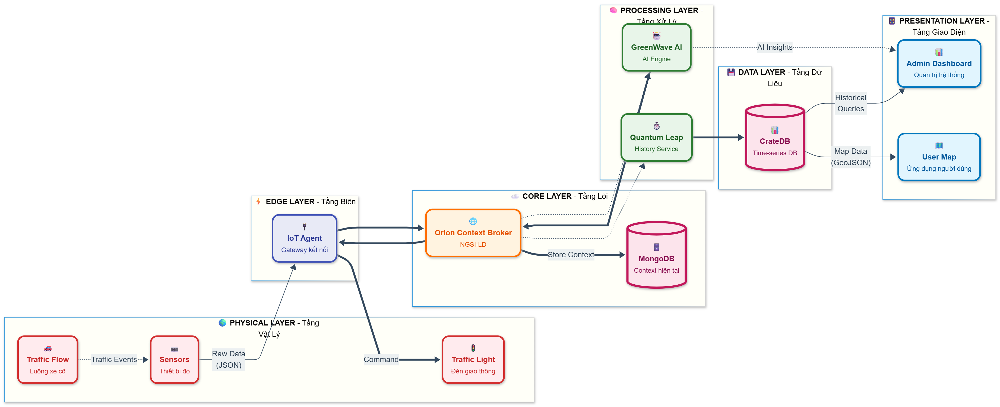

<!--
 Copyright (c) 2025 Green Wave Team

 This software is released under the MIT License.
 https://opensource.org/licenses/MIT
-->

<div align="center">


# GreenWave - Smart Traffic Management System

### _AI-Powered Traffic Optimization for Cleaner Cities_

[](https://opensource.org/licenses/MIT)
[](https://www.fiware.org/)
[](https://www.docker.com/)

[Documentation](http://localhost:3000) | [ Quick Start](#quick-start) | [ Architecture](http://localhost:3000/docs/architecture) | [ Features](#features)

---

</div>

## Overview

> **⚠️ Warning**
>
> **Disclaimer:** This example is for demo use only. It's not production-ready and may omit important features.

**GreenWave** is an intelligent traffic management system that uses **Reinforcement Learning** to simultaneously optimize traffic flow and reduce environmental pollution. Unlike traditional systems that only focus on minimizing wait times, GreenWave considers real-time air quality data to prevent pollution hotspots near schools, hospitals, and residential areas.

### Key Highlights

- **Multi-Objective Optimization** - Balances traffic flow and air quality simultaneously
- **AI-Driven Decision Making** - Uses Reinforcement Learning (DQN) for intelligent control
- **FIWARE-Based Architecture** - Built on industry-standard IoT platform
- **Real-Time Monitoring** - Live dashboards and analytics for instant insights
- **Linked Data Integration** - Fully NGSI-LD compliant for semantic interoperability

---

## Architecture

<div align="center">



</div>

### Core Components

| Component          | Technology                                                                                             | Purpose                                     |
| ------------------ | ------------------------------------------------------------------------------------------------------ | ------------------------------------------- |
| **Context Broker** |                            | Real-time context management (NGSI-LD)      |
| **AI Engine**      |     | Reinforcement Learning traffic optimization |
| **Simulation**     |                                     | Urban mobility simulation                   |
| **Time-Series DB** |                               | Historical data storage & analytics         |
| **Frontend**       |        | Admin dashboard & public portal             |
| **Database**       |  | Current state persistence                   |

---

## Features

### **Intelligent Control**

- [x] **AI-Driven Traffic Coordination** - DQN-based adaptive signal control
- [x] **Multi-Objective Optimization** - Balance traffic flow & air quality
- [x] **Real-Time Decision Making** - Sub-second response to traffic changes

### **Environmental Awareness**

- [x] **Air Quality Monitoring** - PM2.5, CO, NO2 sensors at intersections
- [x] **Emission Estimation** - Traffic-based pollution prediction
- [x] **Pollution Hotspot Prevention** - Protect sensitive areas

### **Monitoring & Visualization**

**Admin Dashboard** - Comprehensive control panel with AI/manual modes

- [x] **Public Air Quality Portal** - User-facing environmental metrics
- [x] **Historical Analytics** - Time-series data visualization

### **DevOps & Standards**

- [x] **CI/CD Pipeline** - Automated testing & deployment
- [x] **OpenAPI Documentation** - Comprehensive API specs
- [x] **Open Source Compliance** - MIT License, Contributing Guidelines

---

## Quick Start

### Prerequisites

| Requirement | Version | Download                                           |
| ----------- | ------- | -------------------------------------------------- |
| **Docker**  | 28.3.2+ | [Get Docker](https://www.docker.com/get-started/)  |
| **Node.js** | 24.6.0+ | [Get Node.js](https://nodejs.org/en/download)      |
| **SUMO**    | 1.25.0+ | [Get SUMO](https://sumo.dlr.de/docs/Downloads.php) |

### Launch All Services

```bash
# Start all services with Docker Compose
docker compose up -d
```

### Access Points

Once services are running, access them at:

| Service            | URL                                            | Description                  |
| ------------------ | ---------------------------------------------- | ---------------------------- |
| **Frontend**       | [http://localhost:5173](http://localhost:5173) | User & Admin interfaces      |
| **Documentation**  | [http://localhost:3000](http://localhost:3000) | Full technical documentation |
| **Backend API**    | [http://localhost:8000](http://localhost:8000) | REST API endpoints           |
| **Context Broker** | [http://localhost:1026](http://localhost:1026) | Orion-LD NGSI-LD API         |

---

## Learn More

<div align="center">

### **[Read Full Documentation](http://localhost:3000)**

Explore detailed tutorials, API references, architecture guides, and more!

</div>

---

## Contribution

Thanks to all [contributors](http://localhost:3000/docs/category/contributing), your help is greatly appreciated!

Contributions are welcome! Please read the [contribution guidelines](http://localhost:3000/docs/contributing/contribution-guidelines) and [code of conduct](http://localhost:3000/docs/contributing/code-of-conduct) to learn how to participate.

---

## License

This project is licensed under the **MIT License** - see the [LICENSE](LICENSE) file for details.

---

<div align="center">

**Made by Green Wave Team**

_Building smarter, cleaner cities through AI and IoT_

</div>
