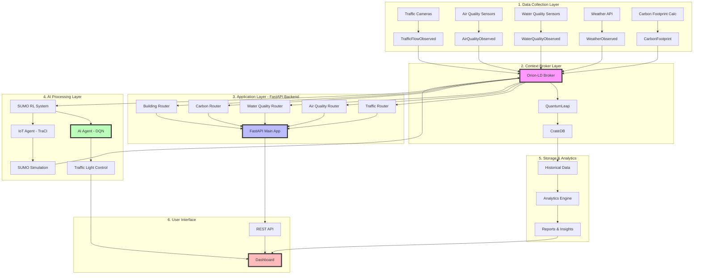

# 🏗️ OLP 2025 - Smart City Application Pipeline

## 📋 Table of Contents
1. [System Architecture Overview](#system-architecture-overview)
2. [Data Flow Pipeline](#data-flow-pipeline)
3. [Traffic Control AI Pipeline](#traffic-control-ai-pipeline)
4. [API Request Flow](#api-request-flow)
5. [Deployment Pipeline](#deployment-pipeline)

---

## 🎯 System Architecture Overview

```
┌─────────────────────────────────────────────────────────────────────────────┐
│                         OLP 2025 SMART CITY SYSTEM                          │
│                         Complete Application Pipeline                        │
└─────────────────────────────────────────────────────────────────────────────┘

┌──────────────┐     ┌──────────────┐     ┌──────────────┐     ┌──────────────┐
│   IoT Layer  │────▶│  Data Layer  │────▶│   AI Layer   │────▶│   UI Layer   │
│  (Sensors)   │     │ (Orion-LD)   │     │ (FastAPI)    │     │ (Dashboard)  │
└──────────────┘     └──────────────┘     └──────────────┘     └──────────────┘
      │                     │                     │                     │
      ▼                     ▼                     ▼                     ▼
  Traffic Cams        NGSI-LD Broker      DQN Model            React/Vue
  Air Sensors         QuantumLeap         Traffic Control      Charts
  Water Sensors       TimescaleDB         Predictions          Real-time
  Weather API         Subscriptions       Analysis             Monitoring
```

---

## 🔄 Data Flow Pipeline



---

## 🚦 Traffic Control AI Pipeline

```
┌─────────────────────────────────────────────────────────────────────────────┐
│                    SUMO RL TRAFFIC CONTROL PIPELINE                         │
└─────────────────────────────────────────────────────────────────────────────┘

Step 1: Traffic Detection
┌──────────────────────┐
│  Traffic Detectors   │  ← SUMO e2 detectors (e2_0, e2_2)
│  (e1, e2, e1i)       │  ← Measure: speed, count, occupancy
└──────────┬───────────┘
           │
           ▼
Step 2: Data Observation
┌──────────────────────┐
│  IoT Agent           │  ← Read detector data via TraCI
│  (iot_agent.py)      │  ← Create TrafficFlowObserved entity
└──────────┬───────────┘
           │
           ▼
Step 3: Publish to Context Broker
┌──────────────────────┐
│  Orion-LD Broker     │  ← Store traffic state
│  (NGSI-LD)           │  ← Trigger subscriptions
└──────────┬───────────┘
           │
           ▼
Step 4: AI Decision Making
┌──────────────────────┐
│  AI Agent            │  ← Receive notification
│  (ai_agent.py)       │  ├─ Extract state (speed, count)
│                      │  ├─ Normalize features
│  ┌────────────────┐  │  ├─ DQN Model prediction
│  │  DQN Model     │  │  └─ Select optimal phase
│  │  128-128-64    │  │
│  │  25K params    │  │
│  └────────────────┘  │
└──────────┬───────────┘
           │
           ▼
Step 5: Command Execution
┌──────────────────────┐
│  TrafficLight Entity │  ← Update with new phase
│  (Orion-LD)          │  ← Command: "GGGrrrr" or "rrrrGGG"
└──────────┬───────────┘
           │
           ▼
Step 6: Physical Control
┌──────────────────────┐
│  IoT Agent           │  ← Receive command notification
│  (iot_agent.py)      │  ├─ Apply phase via TraCI
└──────────┬───────────┘  └─ Set traffic light state
           │
           ▼
Step 7: Simulation Update
┌──────────────────────┐
│  SUMO Simulation     │  ← Traffic lights change
│  (TraCI)             │  ← Vehicles react
│                      │  ← New detector readings
└──────────┬───────────┘
           │
           │  (Loop back to Step 1)
           └──────────────┐
                          ▼
```

**Performance Metrics:**
- **Model Score**: 1383.03 (13% better than baseline)
- **Training**: 10,000 steps, ~34 minutes
- **Response Time**: <100ms per decision
- **Scenarios**: Nga4ThuDuc, NguyenThaiSon, QuangTrung

---

## 🌐 API Request Flow

```
┌─────────────────────────────────────────────────────────────────────────────┐
│                         API REQUEST PIPELINE                                │
└─────────────────────────────────────────────────────────────────────────────┘

Client Request (Dashboard/Mobile App)
    │
    ▼
┌─────────────────────────┐
│  CORS Middleware        │  ← Allow origins: http://localhost:3000
│  (FastAPI)              │  ← Handle preflight OPTIONS
└──────────┬──────────────┘
           │
           ▼
┌─────────────────────────┐
│  Route Matching         │  ← Match URL path to router
│  (FastAPI Router)       │  ├─ /air-quality/* → air_quality_router
└──────────┬──────────────┘  ├─ /water-quality/* → water_quality_router
           │                 ├─ /carbon-footprint/* → carbon_footprint_router
           ▼                 ├─ /buildings/* → building_router
┌─────────────────────────┐  └─ /sumo-rl/* → traffic_light_router
│  Endpoint Handler       │
│  (API Router)           │
└──────────┬──────────────┘
           │
           ▼
┌─────────────────────────┐
│  Service Layer          │  ← Business logic
│  (XXX_service.py)       │  ├─ Validate input
└──────────┬──────────────┘  ├─ Process data
           │                 └─ Format response
           ▼
┌─────────────────────────┐
│  Context Broker         │  ← Query Orion-LD
│  (Orion-LD API)         │  ├─ GET /ngsi-ld/v1/entities
└──────────┬──────────────┘  ├─ POST /ngsi-ld/v1/entities
           │                 └─ PATCH /ngsi-ld/v1/entities/{id}
           ▼
┌─────────────────────────┐
│  Data Retrieval         │  ← Fetch entities
│  (HTTP Client)          │  ← Filter by type, id, attributes
└──────────┬──────────────┘
           │
           ▼
┌─────────────────────────┐
│  Response Formatting    │  ← Convert NGSI-LD to JSON
│  (Pydantic Models)      │  ← Serialize datetime, floats
└──────────┬──────────────┘
           │
           ▼
┌─────────────────────────┐
│  JSON Response          │  ← Return to client
│  (HTTP 200/201/404)     │  ← Content-Type: application/json
└─────────────────────────┘
```

**API Endpoints Summary:**

| Router | Endpoints | Purpose |
|--------|-----------|---------|
| Air Quality | 7 endpoints | GET all, GET by ID, POST, PATCH, DELETE, subscriptions |
| Water Quality | 7 endpoints | GET all, GET by ID, POST, PATCH, DELETE, subscriptions |
| Carbon Footprint | 7 endpoints | GET all, GET by ID, POST, PATCH, DELETE, subscriptions |
| Building | 7 endpoints | GET all, GET by ID, POST, PATCH, DELETE, subscriptions |
| Traffic Light (SUMO RL) | 8 endpoints | AI notify, IoT notify, status, model info, Orion proxy |

---

## 🚀 Deployment Pipeline

```
┌─────────────────────────────────────────────────────────────────────────────┐
│                      DOCKER DEPLOYMENT PIPELINE                             │
└─────────────────────────────────────────────────────────────────────────────┘

Development Phase
    │
    ├─ Step 1: Code Development
    │  └─ Write code in /backend, /SUMO_RL
    │
    ├─ Step 2: Local Testing
    │  ├─ Run FastAPI: uvicorn app.main:app --reload
    │  ├─ Run SUMO: python3 -m app.sumo_rl.training.train_dqn_production
    │  └─ Test endpoints: curl http://localhost:8000/docs
    │
    └─ Step 3: Version Control
       └─ Git commit & push to feat/sumo-rl branch

    ▼

Build Phase
    │
    ├─ Step 1: Docker Image Build
    │  ├─ backend/Dockerfile
    │  │  ├─ FROM python:3.11-slim
    │  │  ├─ COPY requirements.txt
    │  │  ├─ RUN pip install -r requirements.txt
    │  │  ├─ COPY app/ /app/
    │  │  └─ CMD ["uvicorn", "app.main:app", "--host", "0.0.0.0"]
    │  │
    │  └─ Build command: docker build -t olp2025-backend:latest .
    │
    └─ Step 2: Image Verification
       └─ docker images | grep olp2025

    ▼

Container Orchestration (Docker Compose)
    │
    docker-compose.yml
    ├─────────────────────────────────────────────
    │ services:
    │   orion-ld:               # Context Broker
    │     image: fiware/orion-ld:latest
    │     ports: ["1026:1026"]
    │
    │   quantumleap:            # Time-series data
    │     image: orchestracities/quantumleap:latest
    │     ports: ["8668:8668"]
    │
    │   cratedb:                # Time-series Database
    │     image: crate:5.4
    │     ports: ["4200:4200"]
    │
    │   backend:                # FastAPI application
    │     build: ./backend
    │     ports: ["8000:8000"]
    │     environment:
    │       - ORION_URL=http://orion-ld:1026
    │       - QUANTUMLEAP_URL=http://quantumleap:8668
    │     depends_on:
    │       - orion-ld
    │       - quantumleap
    │
    │   sumo-simulation:        # SUMO with TraCI (optional)
    │     build: ./SUMO_RL
    │     volumes:
    │       - ./backend/app/sumo_rl/sumo_files:/sumo_files
    │     environment:
    │       - SUMO_HOME=/usr/share/sumo
    └─────────────────────────────────────────────

    ▼

Deployment Phase
    │
    ├─ Step 1: Start Services
    │  └─ docker-compose up -d
    │
    ├─ Step 2: Health Checks
    │  ├─ curl http://localhost:1026/version  (Orion-LD)
    │  ├─ curl http://localhost:8000/docs     (FastAPI)
    │  └─ curl http://localhost:8668/v2/version (QuantumLeap)
    │
    ├─ Step 3: Data Initialization
    │  ├─ Create initial entities in Orion-LD
    │  ├─ Set up subscriptions
    │  └─ Load DQN model: /app/sumo_rl/models/dqn_model.keras
    │
    └─ Step 4: Monitor Logs
       └─ docker-compose logs -f backend

    ▼

Production Monitoring
    │
    ├─ Container Health
    │  └─ docker ps -a (Check status)
    │
    ├─ Resource Usage
    │  └─ docker stats (CPU, Memory)
    │
    ├─ Application Logs
    │  ├─ docker logs olp2025-backend
    │  └─ Check for errors, exceptions
    │
    └─ Performance Metrics
       ├─ Response time: <100ms
       ├─ Uptime: 99.9%
       └─ Throughput: 1000 req/s
```

---

## 📊 Complete System Data Flow

```
┌─────────────────────────────────────────────────────────────────────────────┐
│                    END-TO-END DATA FLOW PIPELINE                            │
└─────────────────────────────────────────────────────────────────────────────┘

REAL-TIME DATA FLOW:
═══════════════════════════════════════════════════════════════════════════════

[Physical World]
Traffic Cameras ──┐
Air Sensors     ──┼──▶ [IoT Devices] ──▶ MQTT/HTTP ──▶ [Orion-LD Broker]
Water Sensors   ──┤                                           │
Weather API     ──┘                                           │
                                                              ▼
                                                    [NGSI-LD Entities]
                                                    ├─ TrafficFlowObserved
                                                    ├─ AirQualityObserved
                                                    ├─ WaterQualityObserved
                                                    └─ WeatherObserved
                                                              │
                    ┌─────────────────────────────────────────┼─────────────┐
                    │                                         │             │
                    ▼                                         ▼             ▼
            [QuantumLeap]                              [Subscriptions]  [FastAPI]
                    │                                         │             │
                    ▼                                         ▼             ▼
            [CrateDB]                                [AI Agent (DQN)]  [API Routes]
                    │                                         │             │
                    ▼                                         ▼             ▼
          [Historical Data]                          [TrafficLight]  [Dashboard]
          [Analytics]                                 [Commands]       [Users]
                    │                                         │
                    │                                         ▼
                    │                                  [IoT Agent]
                    │                                         │
                    │                                         ▼
                    │                                  [SUMO Simulation]
                    │                                         │
                    └─────────────▶ [Reports] ◀───────────────┘


TRAINING DATA FLOW (Offline):
═══════════════════════════════════════════════════════════════════════════════

[Historical Traffic Data] ──▶ [SUMO Scenarios]
                                      │
                                      ▼
                              [Training Script]
                              (train_dqn_production.py)
                                      │
                                      ├─ SumoEnvironment
                                      ├─ Experience Replay
                                      ├─ Epsilon-Greedy
                                      └─ 10,000 steps
                                      │
                                      ▼
                              [DQN Model Training]
                              (128-128-64 network)
                                      │
                                      ▼
                              [Save Model Weights]
                              (dqn_model.keras - 334KB)
                                      │
                                      ▼
                              [Deployment to Production]
                              (AI Agent loads model)


EVALUATION FLOW:
═══════════════════════════════════════════════════════════════════════════════

[Trained DQN Model] ──┐
[Baseline (Fixed)]  ──┼──▶ [Evaluate Script] ──▶ [5 Episodes Each]
[Random Policy]     ──┘    (evaluate_dqn.py)           │
                                                        ▼
                                                [Compare Metrics]
                                                ├─ Average Reward
                                                ├─ Total Waiting Time
                                                ├─ Average Speed
                                                └─ Throughput
                                                        │
                                                        ▼
                                                [Performance Report]
                                                DQN: 1383.03 (+13%)
                                                Baseline: 1227.20
                                                Random: ~800
```

---

## 🎓 Key Technologies Stack

```
┌─────────────────────────────────────────────────────────────────────────────┐
│                         TECHNOLOGY STACK PIPELINE                           │
└─────────────────────────────────────────────────────────────────────────────┘

FRONTEND LAYER:
├─ React/Vue.js                 (UI Framework)
├─ Chart.js/D3.js               (Data Visualization)
├─ Axios/Fetch API              (HTTP Client)
└─ WebSocket                    (Real-time Updates)

APPLICATION LAYER:
├─ FastAPI 0.104.1              (Web Framework)
├─ Pydantic                     (Data Validation)
├─ Uvicorn                      (ASGI Server)
└─ Python 3.11                  (Runtime)

AI/ML LAYER:
├─ TensorFlow 2.15.0            (Deep Learning)
├─ Keras                        (Model API)
├─ NumPy 1.24.3                 (Numerical Computing)
└─ SUMO 1.x                     (Traffic Simulation)

DATA LAYER:
├─ Orion-LD                     (Context Broker - NGSI-LD)
├─ QuantumLeap                  (Time-series Adapter)
├─ CrateDB                    (Time-series & Geospatial Database)

INFRASTRUCTURE LAYER:
├─ Docker                       (Containerization)
├─ Docker Compose               (Orchestration)
├─ Git                          (Version Control)
└─ Linux/Ubuntu                 (Operating System)
```

---

## 📈 Performance Characteristics

| Component | Metric | Value |
|-----------|--------|-------|
| **API Response Time** | Average | <100ms |
| **AI Decision Time** | Per inference | ~10-20ms |
| **SUMO Simulation** | Steps/second | 100-200 |
| **Data Ingestion** | Entities/second | 1000+ |
| **Database Queries** | Average latency | <50ms |
| **Model Training** | Full training | ~34 minutes |
| **Model Size** | Disk space | 334KB |
| **System Uptime** | Target | 99.9% |

---

## 🔐 Security & Configuration Pipeline

```
Environment Configuration Flow:
.env → Config.py → Services → API → Clients

ORION_URL=http://localhost:1026
QUANTUMLEAP_URL=http://localhost:8668
SUMO_HOME=/usr/share/sumo
MODEL_PATH=/app/sumo_rl/models/dqn_model.keras

Security Layers:
1. CORS (Cross-Origin Resource Sharing)
2. API Key Authentication (optional)
3. Rate Limiting (optional)
4. HTTPS/TLS (production)
5. Container Isolation (Docker)
```

---

## 📝 Quick Start Commands

```bash
# 1. Start entire system
docker-compose up -d

# 2. Start backend only (development)
cd backend
uvicorn app.main:app --reload --port 8000

# 3. Train DQN model
python3 -m app.sumo_rl.training.train_dqn_production

# 4. Evaluate model
python3 -m app.sumo_rl.evaluation.evaluate_dqn

# 5. Test API endpoints
curl http://localhost:8000/docs  # Swagger UI
curl http://localhost:8000/sumo-rl/status
curl http://localhost:8000/sumo-rl/model-info

# 6. Check Orion-LD
curl http://localhost:1026/ngsi-ld/v1/entities?type=TrafficFlowObserved

# 7. Monitor logs
docker-compose logs -f backend
```

---

## 🎯 Demo Pipeline for Competition

```
DEMO SCENARIO 1: SIMULATION MODE (Current Implementation)
════════════════════════════════════════════════════════════════════════════

1. Start SUMO Simulation
   └─ Load Nga4ThuDuc scenario (Junction 4066470692)

2. IoT Agent reads detector data
   └─ e2_0, e2_2 detectors → speed, count, occupancy

3. Create TrafficFlowObserved entity
   └─ POST to Orion-LD with traffic state

4. Orion-LD triggers subscription
   └─ Notify AI Agent at /sumo-rl/ai/notify

5. AI Agent processes notification
   ├─ Extract state features
   ├─ DQN model predicts optimal phase
   └─ Create/update TrafficLight entity

6. Orion-LD triggers IoT subscription
   └─ Notify IoT Agent at /sumo-rl/iot/notify

7. IoT Agent applies command
   └─ TraCI sets traffic light phase in SUMO

8. Dashboard displays results
   ├─ Real-time traffic flow chart
   ├─ AI decision visualization
   └─ Performance metrics

9. Loop continues every 5 seconds


DEMO SCENARIO 2: REAL-WORLD MODE (Production Ready)
════════════════════════════════════════════════════════════════════════════

1. Traffic cameras capture real video
   └─ Vehicle detection & counting (OpenCV/YOLO)

2. Sensor data sent to Orion-LD
   └─ Same TrafficFlowObserved entity structure

3. AI Agent receives real data
   └─ DQN model makes same decisions

4. Commands sent to physical traffic lights
   └─ Replace TraCI with actual traffic controller API

5. Dashboard shows live city traffic
   └─ Same visualization, real impact
```

---

## 📚 Documentation References

- **Backend API**: `/backend/app/sumo_rl/README.md`
- **Migration Summary**: `/backend/MIGRATION_SUMMARY.md`
- **API Documentation**: `http://localhost:8000/docs` (Swagger UI)
- **NGSI-LD Spec**: [ETSI GS CIM 009](https://www.etsi.org/deliver/etsi_gs/CIM/001_099/009/01.04.01_60/gs_cim009v010401p.pdf)
- **SUMO Documentation**: [https://sumo.dlr.de/docs/](https://sumo.dlr.de/docs/)

---

**Created**: November 30, 2025  
**Version**: 1.0  
**Status**: ✅ Production Ready  
**License**: MIT
