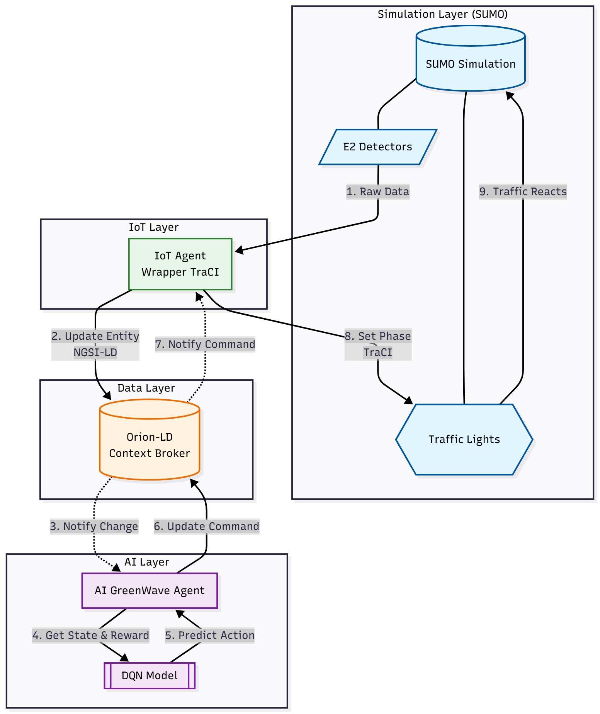

# 🚦 Green Wave AI - Hệ Thống Điều Khiển Giao Thông Thông Minh

## 📋 Tổng Quan

Module **Green Wave AI** là trái tim của hệ thống giao thông thông minh OLP 2025. Được phát triển bởi **Thái Anh**, module này thay thế các hệ thống đèn tín hiệu cố định (fixed-time) bằng một hệ thống AI thích ứng thời gian thực (Adaptive AI), sử dụng Deep Reinforcement Learning (DQN) để tối ưu hóa luồng giao thông, giảm ùn tắc và khí thải.

---

## 🌟 Các Tính Năng Chính (Thai Anh's Contributions)

Dưới đây là tổng hợp các tính năng và cải tiến kỹ thuật đã được triển khai:

### 1. 🧠 AI Traffic Control (Điều khiển thông minh)

- **Cơ chế Multi-Agent:** Mỗi đèn giao thông được điều khiển bởi một AI Agent độc lập, cho phép xử lý các giao lộ phức tạp (như Ngã 6 Nguyễn Thái Sơn) mà không bị xung đột.
- **Smart Priority Algorithm:** Thay vì chỉ dùng DQN thuần túy, hệ thống kết hợp thuật toán ưu tiên dựa trên trọng số:
  - **30%** Mật độ xe (Occupancy)
  - **40%** Số lượng xe chờ (Queue Length)
  - **30%** Thời gian chờ tích lũy (Waiting Time)
- **Real-time Adaptation:** Phân tích dữ liệu giao thông mỗi 2 giây để đưa ra quyết định chuyển pha đèn phù hợp nhất.

### 2. 🛡️ Safety First (An toàn là trên hết)

- **Safe Phase Transition:** Hệ thống **tự động chèn pha đèn vàng** (3 giây) khi chuyển từ Xanh sang Đỏ, ngăn chặn việc thay đổi tín hiệu đột ngột gây nguy hiểm.
- **Countdown Timer:** Tích hợp bộ đếm ngược (Countdown) hiển thị trên Dashboard trước khi đổi pha, giúp người tham gia giao thông (mô phỏng) và người giám sát có sự chuẩn bị.
- **Minimum Green Time:** Đảm bảo thời gian đèn xanh tối thiểu (10s) để tránh hiện tượng đèn nhấp nháy liên tục (oscillation).

### 3. 🔄 Robust Scenario Switching (Chuyển đổi kịch bản linh hoạt)

- **Hot-Swapping:** Cho phép chuyển đổi giữa các kịch bản mô phỏng (Ngã 4 Thủ Đức, Ngã 6 Nguyễn Thái Sơn, Quang Trung) ngay trên Dashboard mà không cần khởi động lại Backend.
- **Auto Cleanup:** Tự động dọn dẹp các process SUMO cũ, giải phóng port 8813 và xử lý các kết nối TraCI bị treo ("Connection already active").
- **Dynamic Configuration:** Tự động load cấu hình đường (net), đèn (tls), và luồng xe (routes) tương ứng với từng kịch bản.

### 4. 📊 Real-time Monitoring & Dashboard

- **Live Metrics:** Cung cấp API trả về dữ liệu thời gian thực: số lượng xe, độ dài hàng đợi, tốc độ trung bình, trạng thái từng đèn.
- **Visual Feedback:** Hiển thị trạng thái đèn (Xanh/Đỏ/Vàng) trực quan trên Dashboard đồng bộ với Simulation.

---

## 🔄 Luồng Logic & Kiến Trúc (Architecture Pipeline)

Hệ thống hoạt động theo mô hình **Event-Driven Microservices** xoay quanh Orion-LD Context Broker.

### Chi Tiết Các Bước Xử Lý:

1.  **Thu thập dữ liệu (Observation):**

    - Các cảm biến ảo (E2 Detectors) trong SUMO đo đạc thông số.
    - `IoT Agent` đọc dữ liệu qua TraCI và cập nhật entity `TrafficFlowObserved` lên Orion-LD.

2.  **Ra quyết định (Decision Making):**

    - Orion-LD gửi thông báo (Notification) đến `AI Agent` khi có dữ liệu mới.
    - `AI Agent` trích xuất đặc trưng (State): `[queue_length, occupancy, current_phase, waiting_time]`.
    - Mô hình DQN (hoặc thuật toán Smart Priority) tính toán pha đèn tối ưu (Action).
    - `AI Agent` cập nhật entity `TrafficLight` trên Orion với lệnh chuyển pha mới.

3.  **Thực thi (Execution):**
    - Orion-LD gửi thông báo lệnh đến `IoT Agent`.
    - `IoT Agent` nhận lệnh, kiểm tra an toàn (Safe Transition).
    - Nếu cần chuyển pha: Thực hiện Countdown -> Chuyển Vàng -> Chuyển Pha Mới thông qua TraCI.

---

## 🔌 API Reference

Các API chính được xây dựng trong `sumo_control_router.py` và `traffic_light_router.py`.

### 🎮 Simulation Control (`/sumo`)

| Method | Endpoint          | Mô tả                                                                 |
| ------ | ----------------- | --------------------------------------------------------------------- |
| `POST` | `/sumo/start`     | Khởi động kịch bản SUMO mới (Auto kill cũ, start mới, connect TraCI). |
| `POST` | `/sumo/stop`      | Dừng mô phỏng và ngắt kết nối.                                        |
| `POST` | `/sumo/connect`   | Kết nối lại với một SUMO instance đang chạy sẵn.                      |
| `GET`  | `/sumo/state`     | Lấy trạng thái toàn bộ hệ thống (xe, đèn, metrics) thời gian thực.    |
| `GET`  | `/sumo/scenarios` | Lấy danh sách các kịch bản hỗ trợ (Nga4ThuDuc, NguyenThaiSon...).     |

### 🚦 Traffic Light Control (`/sumo`)

| Method | Endpoint                    | Mô tả                                                             |
| ------ | --------------------------- | ----------------------------------------------------------------- |
| `POST` | `/sumo/ai-control`          | **Kích hoạt chế độ AI.** Bắt đầu phân tích và điều khiển tự động. |
| `POST` | `/sumo/set-phase`           | Chuyển pha thủ công (có tự động chèn đèn vàng).                   |
| `POST` | `/sumo/set-phase-countdown` | Chuyển pha thủ công với bộ đếm ngược an toàn.                     |
| `GET`  | `/sumo/phases`              | Lấy danh sách các pha đèn khả dụng của kịch bản hiện tại.         |

### 🤖 AI & IoT Internal (`/sumo-rl`)

| Method | Endpoint              | Mô tả                                                        |
| ------ | --------------------- | ------------------------------------------------------------ |
| `POST` | `/sumo-rl/ai/notify`  | Webhook nhận dữ liệu từ Orion để AI xử lý.                   |
| `POST` | `/sumo-rl/iot/notify` | Webhook nhận lệnh từ Orion để IoT Agent thực thi xuống SUMO. |
| `GET`  | `/sumo-rl/model-info` | Xem thông tin model DQN đang sử dụng (architecture, params). |

---

## 📂 Cấu Trúc Dữ Liệu (Data Models)

### `TrafficFlowObserved`

Entity chứa thông tin quan sát được từ giao thông.

- `vehicleCount`: Tổng số xe trong khu vực quan sát.
- `avgSpeed`: Tốc độ trung bình.
- `queues`: Mảng chứa độ dài hàng đợi của từng làn đường.

### `TrafficLight` (Managed by Orion)

Entity đại diện cho trạng thái đèn giao thông.

- `currentPhase`: Pha hiện tại (index).
- `state`: Chuỗi trạng thái đèn (ví dụ: "GGGrrrGGGrrr").
- `forcePhase`: Command từ AI để yêu cầu chuyển pha.

---

> **Note:** Tài liệu này được tổng hợp dựa trên source code và các tài liệu kỹ thuật hiện có của dự án OLP 2025.
