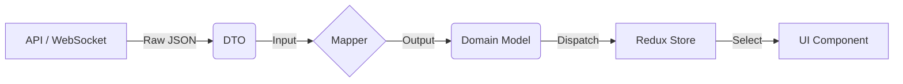

# GreenWave Digital Twin - Frontend

Frontend application cho hệ thống giám sát và điều khiển giao thông thông minh.

## Tính Năng

- ✅ **Digital Twin Visualization**: Hiển thị bản đồ giao thông real-time với Leaflet
- ✅ **Area Selection**: Chọn và khóa góc nhìn vào khu vực cụ thể
- ✅ **Real-time Updates**: WebSocket connection để nhận dữ liệu real-time
- ✅ **Traffic Control**: Điều khiển pha đèn giao thông
- ✅ **Statistics Dashboard**: Hiển thị thống kê giao thông và chất lượng không khí

## Tech Stack

- **React 19** + **TypeScript**
- **Redux Toolkit** - State management
- **Leaflet** - Interactive maps
- **TailwindCSS** - Styling
- **Vite** - Build tool
- **WebSocket** - Real-time communication

## Cài Đặt

```bash
npm install
```

## Cấu Hình

Tạo file `.env`:

```env
VITE_API_URL=http://localhost:3001
VITE_WS_URL=ws://localhost:8765
VITE_ORION_URL=http://localhost:1026/ngsi-ld/v1
```

## Chạy Development

```bash
npm run dev
```

Mở http://localhost:5173

## Build Production

```bash
npm run build
npm run preview
```

## Cấu Trúc Source Code (Chi tiết)

Dự án tuân thủ kiến trúc **Clean Architecture** kết hợp với **Feature-based Folder Structure** để đảm bảo tính mở rộng và dễ bảo trì.

```
src/
├── api/                    # Cấu hình API client và các endpoints
├── app/                    # Cấu hình toàn cục (Redux store, providers)
├── assets/                 # Tài nguyên tĩnh (images, icons, fonts)
├── data/                   # Data Layer - Xử lý dữ liệu
│   ├── dtos/               # Data Transfer Objects (từ API/Socket)
│   ├── mappers/            # Chuyển đổi dữ liệu từ DTO -> Domain Model
│   └── redux/              # Redux slices và selectors
├── domain/                 # Domain Layer - Business Logic (Pure TS)
│   ├── models/             # Các entities và types (e.g., User.ts, SensorModel.ts)
│   ├── repositories/       # Interfaces cho repositories
│   └── use-cases/          # Các luồng nghiệp vụ (Business Rules)
├── presentation/           # Presentation Layer - UI (React)
│   ├── components/         # Components tái sử dụng
│   │   ├── feature/        # Components đặc thù theo tính năng (TrafficMap, etc.)
│   │   └── ui/             # Components cơ bản (Button, Input - nếu có)
│   ├── container/          # Container components (kết nối Logic & UI)
│   ├── hooks/              # Custom Hooks (useWebSocket, etc.)
│   ├── pages/              # Các trang chính (Route components)
│   ├── styles/             # Global styles, Tailwind config
│   └── utils/              # Các hàm tiện ích (Helpers)
├── services/               # Tích hợp dịch vụ bên ngoài
└── main.tsx                # Entry point
```

## Quy Tắc Code (Coding Conventions)

### 1. Quy Tắc Đặt Tên (Naming Conventions)

- **Files & Directories**:
  - **Components**: PascalCase (VD: `TrafficMap.tsx`, `StatCard.tsx`).
  - **Models**: PascalCase, thường có hậu tố `Model` hoặc `.types` (VD: `AirQualityObservedModel.ts`, `simulation.types.ts`).
  - **Hooks**: camelCase, bắt đầu bằng `use` (VD: `useWebSocket.ts`).
  - **Utilities**: camelCase (VD: `formatDate.ts`).
- **Variables & Functions**: camelCase (VD: `handleTrafficUpdate`, `isLoading`).
- **Constants**: UPPER_SNAKE_CASE (VD: `MAX_RETRY_COUNT`).
- **Interfaces/Types**: PascalCase (VD: `TrafficLightState`).

### 2. Kiến Trúc & Tổ Chức

- **Domain Layer**: Tuyệt đối không phụ thuộc vào UI (React) hay Framework cụ thể. Chỉ chứa logic nghiệp vụ và định nghĩa kiểu dữ liệu.
- **Data Layer**: Chịu trách nhiệm lấy dữ liệu (API, WebSocket) và chuyển đổi (Map) sang Domain Model trước khi đưa lên UI.
- **Presentation Layer**: Chỉ hiển thị dữ liệu. Logic phức tạp nên được tách ra Custom Hooks hoặc Use Cases.

### 3. Component Guidelines

- **Functional Components**: Sử dụng React Hooks.
- **Single Responsibility**: Mỗi component chỉ nên làm một việc. Tách nhỏ nếu component quá lớn (> 200 dòng).
- **Feature Folders**: Các components liên quan chặt chẽ đến một tính năng (VD: Traffic) nên gom vào `presentation/components/feature`.

### 4. State Management

- **Redux Toolkit**: Sử dụng cho global state (dữ liệu chia sẻ giữa nhiều trang/components).
- **Local State**: Sử dụng `useState`, `useReducer` cho trạng thái nội bộ của component.

### 5. Styling

- Sử dụng **Tailwind CSS** làm công cụ styling chính.
- Hạn chế inline styles.
- Class names nên được sắp xếp gọn gàng.

## Luồng Dữ Liệu (Data Layer Workflow)

Hệ thống tuân thủ nghiêm ngặt quy trình xử lý dữ liệu để đảm bảo tính tách biệt (Separation of Concerns) giữa dữ liệu thô từ Server và dữ liệu nghiệp vụ trong App.

### 1. Giải Thích Thành Phần

- **DTOs (`data/dtos`)**:
  - Là **Data Transfer Objects**. Định nghĩa cấu trúc dữ liệu **chính xác** như Server trả về (Raw JSON).
  - _Nguyên tắc_: Không bao giờ sử dụng DTO trực tiếp trong UI Components.
- **Mappers (`data/mappers`)**:
  - Là lớp trung gian chuyển đổi `DTO` -> `Domain Model`.
  - Nơi xử lý logic làm sạch dữ liệu, default values, hoặc format lại dữ liệu cho phù hợp với Frontend.
  - _Lợi ích_: Nếu Backend thay đổi cấu trúc API, chỉ cần sửa Mapper, không cần sửa UI.
- **Redux (`data/redux`)**:
  - Quản lý Global State.
  - Chỉ lưu trữ **Domain Models**, không lưu trữ DTOs.

### 2. Quy Trình Xử Lý (Workflow)

Ví dụ: Luồng nhận dữ liệu Real-time từ WebSocket.

1.  **Receive**: `useWebSocket` nhận bản tin JSON từ Server.
2.  **Validate/Cast**: Dữ liệu được ép kiểu về `FeatureDTO` (Interface định nghĩa trong `dtos`).
3.  **Map**: Gọi hàm `FeatureMapper.toDomain(dto)` để chuyển đổi sang `FeatureModel`.
4.  **Dispatch**: Gửi `FeatureModel` vào Redux Store thông qua Action (VD: `setTrafficData`).
5.  **Render**: UI Component sử dụng `useSelector` để lấy `FeatureModel` từ Store và hiển thị.



## Components

### TrafficMap

Bản đồ Leaflet hiển thị:

- Vehicles với rotation theo góc
- Traffic lights với màu sắc theo trạng thái
- Locked view vào khu vực được chọn

### AreaSelector

Chọn khu vực giám sát:

- Ngã Tư Thủ Đức
- Ngã Tư Hàng Xanh
- (Có thể thêm nhiều khu vực)

### TrafficStats

Hiển thị thống kê:

- Hàng đợi xe (queues)
- Pha đèn hiện tại
- PM2.5 (chất lượng không khí)
- AI Reward Score

### TrafficControl

Điều khiển đèn giao thông:

- Pha 0: Đông-Tây
- Pha 1: Bắc-Nam
- Pha 2: Chuyển tiếp

## WebSocket Integration

```typescript
const { isConnected, lastMessage, sendCommand } = useWebSocket({
  url: "ws://localhost:8765",
  onMessage: (data) => {
    // Handle simulation update
  },
});

// Send command
sendCommand({ type: "setPhase", phase: 1 });
```

## License

MIT
